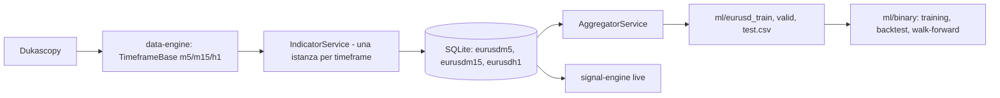

# Pipeline ML e risultati della ricerca (ottobre 2026)

Stato al 2026-10-08. Questo documento riassume la pipeline dati e ML, i bug trovati e corretti, gli strumenti disponibili, i risultati degli esperimenti e i prossimi passi.

## 1. Sintesi

- La pipeline dati è stata corretta (due bug gravi, vedi sezione 3) e i dataset sono stati rigenerati. Il controllo `ml/shared/check_dataset.py` passa su train, valid e test.
- Con i dati corretti, un backtest realistico (ingresso all'open della barra successiva, spread 0.8 pip) e un walk-forward annuale, **le feature tecniche attuali non mostrano un edge direzionale robusto** su EURUSD m5–h1.
- Quello che i modelli riescono a prevedere è la **volatilità** (R² 0.58 a 1 ora, stabile in tutti i fold), non la direzione del prezzo.
- **I modelli in `apps/signal-engine` e quelli in `ml/binary` non sono validi per il live.** Il signal-engine non può partire: i file `apps/signal-engine/model_*_atr.txt` non vengono caricati da LightGBM (errore di formato del modello) e, anche se lo fossero, sono stati addestrati sui dati corrotti.

## 2. Flusso dati



Intervalli dei CSV: train 2020-01-01 / 2022-12-31, valid 2023-01-01 / 2024-12-31, test 2025-01-01 / 2026-05-31.

## 3. Bug trovati e corretti

| Bug | Effetto | Correzione |
|---|---|---|
| `IndicatorService` registrato come singleton in `apps/data-engine/src/core/container.ts` e iniettato dai tre timeframe | m5, m15 e h1 condividevano lo stesso stato degli indicatori (ATR, EMA, RSI, MACD...). Tutti gli indicatori erano contaminati, in modo disomogeneo nel tempo (ATR m5 mediano da 3 a 114 pip contro i ~3.5 reali) | `inTransientScope()`: una istanza per timeframe |
| `AggregatorService.aggregatoToCSV` indicizzava le label con un contatore che non avanzava sulle righe scartate | Le label `target_*_atr_*` scorrevano rispetto alle feature fino a ~490 barre | Indice sulla riga m5 |
| Priorità TP/SL nel backtest: si cercava prima il TP su tutta la finestra | Winrate e profit factor gonfiati | Vince la barriera toccata per prima, a parità di barra vince SL |
| Ingresso al close della barra del segnale, senza spread | PNL ottimistico | Ingresso all'open successivo, spread parametrico (`--spread-pips`, default 0.8) |

L'allineamento tra timeframe (`findClosest15M`, `findClosest1H`) è stato verificato: usa sempre candele già chiuse, nessun look-ahead.

## 4. Rigenerare i dataset

Prerequisito: `npm install` e `npm run build` in `apps/data-engine`. I comandi, da PowerShell nella root del repository:

```powershell
# Ricalcolo degli indicatori dalle candele grezze di un DB esistente verso un DB nuovo
py database\migrations\eurusd_create_database.py
$env:SOURCE_DATABASE_PATH = "$PWD\database\eurusd-data.OLD.db"
node apps\data-engine\dist\rebuild-indicators.js
Remove-Item Env:SOURCE_DATABASE_PATH

# CSV di train, valid e test
$js = "$PWD\apps\data-engine\dist\aggregate-cli.js"
node $js '2020-01-01T00:00:00.000Z' '2022-12-31T23:59:59.999Z' "$PWD\ml\eurusd_train.csv"
node $js '2023-01-01T00:00:00.000Z' '2024-12-31T23:59:59.999Z' "$PWD\ml\eurusd_valid.csv"
node $js '2025-01-01T00:00:00.000Z' '2026-05-31T23:59:59.999Z' "$PWD\ml\eurusd_test.csv"

# Controllo di qualità (ATR vs OHLC, allineamento label): deve stampare OK
py ml\shared\check_dataset.py ml\eurusd_train.csv ml\eurusd_valid.csv ml\eurusd_test.csv
```

`DATABASE_PATH` permette di puntare il data-engine a un database diverso da `database/eurusd-data.db`, utile per le prove.

Nota ambientale: su questa macchina `python` è lo stub del Microsoft Store. Usare `py`.

## 5. Strumenti ML (`ml/`)

| File | Funzione |
|---|---|
| `shared/features.py` | Elenchi feature (`new` 65 colonne, `legacy` 92), feature derivate, ATR di Wilder da OHLC |
| `shared/labels.py` | Label triple-barrier (TP/SL/tempo massimo, first-touch) |
| `shared/check_dataset.py` | Controllo di coerenza dei CSV |
| `binary/backtest_optimized.py` | Motore di backtest (predizione batch, spread, ingresso all'open successivo, soglia scelta sul validation) |
| `binary/walk_forward_eval_trade.py` | Walk-forward annuale a livello di trade: train < Y-1, validation Y-1, test Y, embargo di 24 barre |
| `binary/volatility_forecast_eval.py` | Walk-forward della previsione di volatilità |
| `binary/train_model_lightgbm_binary.py` | Training dei modelli binari (`--feature-set`, `--scale-pos-weight`, `--label-mode`) |
| `binary/hparam_search.py`, `binary/walk_forward_eval.py` | Ricerca iperparametri e walk-forward basato sull'AUC (l'AUC non è affidabile con label sovrapposte) |

Esempi:

```powershell
# Walk-forward per trade, label triple-barrier, SL 2 / TP 4 ATR, 48 barre
py ml\binary\walk_forward_eval_trade.py --feature-sets new --label-mode triple-barrier --sl-mult 2 --tp-mult 4 --max-bars 48

# Previsione della volatilità a 1 e 4 ore
py ml\binary\volatility_forecast_eval.py
```

Opzioni utili di `walk_forward_eval_trade.py`: `--label-mode {atr,triple-barrier,direction}`, `--spread-pips`, `--atr-col`, `--sample-hours`, `--top-k`, parametri LightGBM (`--num-leaves`, `--min-data-in-leaf`, `--lambda-l2`, `--feature-fraction`, `--max-depth`, `--learning-rate`).

I log degli script reindirizzati con `*>` in PowerShell 5 sono in UTF-16: leggerli con `Get-Content`.

## 6. Risultati

Tutti i risultati sono walk-forward sui fold di test 2022–2026, spread 0.8 pip, ingresso all'open successivo, dati corretti.

### Direzione (PNL netto totale, fold con PNL netto positivo)

| Configurazione | Fold > 0 | PNL netto | Trade |
|---|---|---|---|
| `new`, label ATR | 0/5 | -0.073 | 1098 |
| `legacy`, label ATR | 0/5 | -0.091 | 1174 |
| `new`, triple-barrier SL 1 / TP 2, 24 barre | 2/5 | -0.047 | 1370 |
| `new`, triple-barrier SL 1.5 / TP 3, 36 barre | 2/5 | -0.063 | 969 |
| `new`, triple-barrier SL 2 / TP 4, 48 barre | 3/5 | -0.0215 | 1355 |
| `legacy`, triple-barrier SL 2 / TP 4, 48 barre | 2/5 | -0.119 | 953 |
| `new`, regolarizzazione forte | 1/5 | -0.0167 | 1146 |
| `new`, regolarizzazione media | 2/5 | -0.0142 | 1001 |
| `new`, regolarizzazione forte, top-25 feature | 2/5 | -0.0225 | 824 |
| `new`, label direzione (modello unico) | 3/5 | -0.0181 | 1027 |
| `new`, barriere su ATR h1, triple-barrier | 1/5 | -0.169 | 1034 |
| `new`, barriere su ATR h1, direzione | 2/5 | -0.2025 | 2025 |

Osservazioni:
- Il PNL lordo è praticamente nullo. Con la label direzione l'early stopping si ferma a 1–5 iterazioni in quasi tutti i fold: il modello non trova segnale direzionale.
- 2025 è positivo in quasi tutte le configurazioni, 2023 e 2024 sono negativi. La differenza non è statisticamente significativa data la quantità di configurazioni provate.
- L'importanza delle feature è dominata da `hour_sin`, `atr14_h1`, `rollingVolatility_h1`. Le feature di forma della candela m5 hanno gain zero.
- `new` è migliore di `legacy` in modo coerente dopo la correzione dei dati.

### Previsione della volatilità (range delle prossime H barre, R² medio sui 5 fold)

| Orizzonte | Persistenza ATR | Stagionalità ora-settimana | LightGBM |
|---|---|---|---|
| 1 ora (12 barre) | 0.435 | 0.278 | **0.583** |
| 4 ore (48 barre) | 0.227 | 0.234 | **0.505** |

Nel quintile con volatilità prevista più alta il range realizzato a 1 ora è 25.1 pip contro 6.7 pip nel quintile più basso. Lo spread da 0.8 pip pesa il 3.2% del range nel primo caso e l'11.9% nel secondo.

### Regole di direzione semplici con filtro di volatilità prevista

`ml/binary/rule_strategies_eval.py`, fold 2022–2026, spread 0.8 pip, SL 1 / TP 2 ATR, 24 barre. Pips per trade; il filtro "alta" tiene il 30% di barre con volatilità prevista maggiore (soglia calcolata sul validation).

| Regola | Filtro | Trade | Lordo | Netto | PF |
|---|---|---|---|---|---|
| Direzione casuale (controllo) | tutte | 3020 | +0.11 | -0.69 | 0.77 |
| Momentum 1 ora (z > 2) | tutte / alta | 31121 / 12092 | -0.16 / -0.10 | -0.96 / -0.90 | 0.71 / 0.80 |
| Breakout 4 ore | tutte / alta | 12542 / 5222 | -0.31 / -0.50 | -1.11 / -1.30 | 0.67 / 0.72 |
| Reversione RSI (20/80) | tutte / bassa | 1376 / 206 | +0.31 / +0.66 | -0.49 / -0.14 | 0.87 / 0.91 |

Nessuna regola è positiva dopo i costi, e il filtro di volatilità non cambia il segno. Momentum e breakout hanno un lordo leggermente negativo (la direzione opposta avrebbe un lordo positivo di 0.2–0.5 pip, comunque sotto lo spread). Il controllo casuale mostra che con ~1000 trade il rumore del lordo è di circa ±0.5 pip, quindi le differenze piccole non sono significative.

### Trend following giornaliero su 7 majors (2003-05 / 2026-09)

`ml/daily/trend_following_eval.py`, dati daily Dukascopy in `ml/daily/<coppia>_d1.csv`. Specifica dichiarata a priori: media dei segnali di momentum a 20, 60, 120 e 250 giorni, volatility targeting al 10% annuo (leva max 4), spread 1 pip, costo di metà spread per unità di turnover, swap e carry non inclusi. Test di permutazione con 500 traslazioni circolari del segnale.

| Coppia | Sharpe lordo | Sharpe netto | p (permutazione) |
|---|---|---|---|
| EURUSD | 0.13 | 0.11 | 0.25 |
| GBPUSD | 0.10 | 0.09 | 0.30 |
| USDJPY | 0.36 | 0.34 | 0.02 |
| AUDUSD | 0.05 | 0.02 | 0.38 |
| USDCAD | -0.13 | -0.16 | 0.76 |
| USDCHF | -0.24 | -0.27 | 0.94 |
| NZDUSD | -0.18 | -0.21 | 0.78 |
| **Portafoglio equal-weight** | 0.02 | **-0.02** | - |

Il portafoglio ha Sharpe netto -0.02 (rendimento -0.1% annuo, drawdown massimo -20.8%): nessun edge. Per sottoperiodo lo Sharpe netto del portafoglio è +0.34 nel 2003-2009, -0.14 nel 2010-2019 e -0.23 dal 2020. USDJPY è l'unica coppia con p < 0.05, ma è una su sette (con correzione per test multipli non è significativa). Il volatility targeting migliora il profilo di rischio (drawdown di EURUSD da circa -40% a -23%) ma non crea rendimento.

## 7. Conclusioni

1. Gli indicatori tecnici su m5–h1 di EURUSD non contengono un segnale direzionale sfruttabile con questi metodi e questi costi.
2. La volatilità è prevedibile in modo stabile. Serve a dimensionare le posizioni, filtrare le ore e regolare le barriere, ma non genera ingressi da sola.
3. Altre feature della stessa famiglia (massimo e minimo del giorno precedente, livelli tondi) hanno una probabilità bassa di cambiare il quadro.

## 8. Prossimi passi, in ordine

1. **Test di plausibilità sul giornaliero: fatto** (vedi sezione 6). Il trend following semplice su 7 majors non ha edge dopo il 2010. Resta aperto l'orizzonte lungo con fonti di rendimento diverse dal solo momentum.
2. **Carry e valore sul giornaliero.** Servono i tassi d'interesse (per esempio FRED) per calcolare il differenziale e includere lo swap nel PNL: è il premio di rischio più documentato sul cambio.
3. **Ampiezza vera: altre classi di attivo giornaliere** (indici azionari, oro, obbligazioni) con lo stesso harness. Il time-series momentum funziona storicamente soprattutto su portafogli diversificati tra classi, non sulle sole majors (che condividono il fattore USD).
2. **Usare la previsione di volatilità** per dimensionamento e filtri combinata con una fonte di direzione basata su regole.
3. **Nuove fonti di informazione** (costoso): feature di struttura del prezzo, calendario macro, tassi, altri asset, storia precedente al 2019, più coppie (ampiezza).
4. Riaddestrare e riattivare il signal-engine solo se uno dei punti sopra mostra un edge netto stabile.

## 9. Avvertenze

- `apps/signal-engine/model_*_atr.txt` non sono caricabili da LightGBM (`Model format error, expect a tree here`), non risultano modificati rispetto a git e sono comunque stati addestrati su dati corrotti. Il signal-engine non parte finché non vengono sostituiti con modelli addestrati e validati. In ogni caso `FEATURE_COLUMNS` (65 feature) controlla il numero di feature all'avvio.
- `ml/binary/model_long_atr.txt` e `ml/binary/model_short_atr.txt` sono tracciati in git ma sono stati sovrascritti da un training di prova su dati corrotti. Per recuperare le versioni originali: `git checkout -- ml/binary/model_long_atr.txt ml/binary/model_short_atr.txt`.
- Gli altri modelli in `ml/binary` (`_legacy`, `_tb`, `_legacy_tb`, `_legacy_tuned`) derivano da esperimenti su dati corrotti e servono solo come riferimento storico.
- Il database della versione precedente è stato rinominato in `database/eurusd-data.OLD.db` e contiene ancora le tabelle `trades` e `aggregationData` originali. Il database corrente arriva al 2026-07-20: al primo avvio il data-engine scaricherà ora per ora il periodo mancante.
- L'avvio con PM2 va fatto solo dopo aver validato un nuovo modello.
